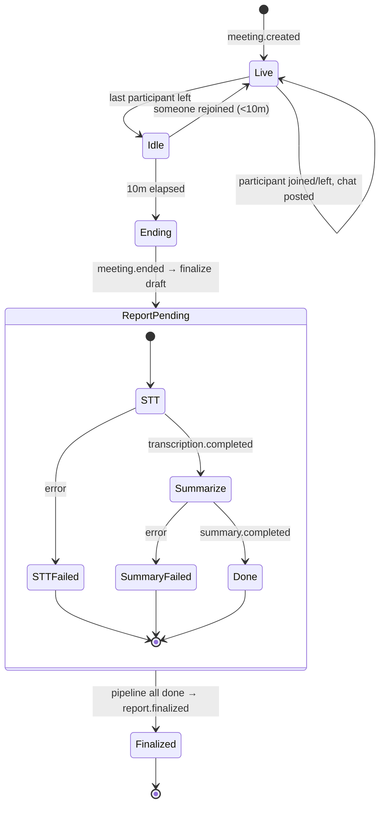
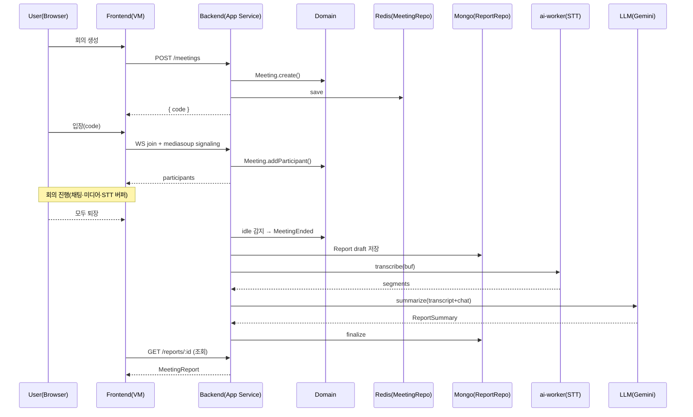

# Architecture & Design Pattern

본 문서는 마이그레이션 신규 프로젝트의 **아키텍처 패턴**과 **도메인 모델(DDD)** 을 정의한다. 구현·테스트는 본 문서에서 합의된 경계 안에서만 진행한다.

---

## 1. 아키텍처 패턴 결정

| 영역       | 채택 패턴                            | 한 줄 요약                                                              |
|----------|----------------------------------|---------------------------------------------------------------------|
| Backend  | **NestJS Layered MVC + DDD 4계층** | Controller/Gateway → Application Service → Domain → Infrastructure  |
| Frontend | **MVVM**                         | Page/Component(View, dumb) ↔ Hook(ViewModel) ↔ Store/Service(Model) |

### 1.1 왜 MVC + MVVM인가

- **현재 PLUM 구조와의 연속성** — 백엔드는 이미 `Controller/Gateway → Service → repository-manager` 계층이라 MVC + Repository 변형이고, 프론트는 `components(View) + hooks(VM) + stores+services(Model)`로 사실상 MVVM이다. 패턴을 새로 강제하기보다 **현재 잘 굴러가는 구조를 명시화·강화**한다.
- **MVP 후보 탈락** — Presenter가 View 이벤트를 모두 받는 모델은 React hooks 시대의 관용과 충돌한다. Container/Presenter 변형도 hook 기반과 중복된다.
- **사용자 강조: "View는 데이터만 보여준다"** — MVVM에서 View가 props로 데이터만 받고 ViewModel에서 상태·액션을 합성하는 분리가 가장 자연스러움.
- **테스트 친화성** — Hook(ViewModel)은 `@testing-library/react`의 `renderHook`으로, Component(View)는 props 기반 스냅숏/렌더 테스트로 독립 검증 가능.

### 1.2 DDD를 함께 쓰는 이유

기능(회의·채팅·미디어·녹음·회의록)이 명확히 분리돼 있어 **Bounded Context**로 자르기 좋고, v2(노션 연동)에서 새 컨텍스트(Notion)를 얹는 흐름이 깨끗해진다. v1에서 도메인 모델을 먼저 잡고 그 위에 MVC/MVVM 계층을 매핑한다.

---

## 2. 도메인 모델 (DDD)

### 2.1 Ubiquitous Language

| 용어                 | 정의                                                                    |
|--------------------|-----------------------------------------------------------------------|
| **Meeting**        | 한 번의 회의 세션. 코드(`code`)로 입장. hard limit 없음, 전원 퇴장 후 idle 10분이면 종료.     |
| **Participant**    | 닉네임만으로 회의에 입장한 사용자. 회원 아님.                                            |
| **MeetingCode**    | 회의 입장용 짧은 식별자(VO). URL의 `/meetings/[code]`.                           |
| **ChatMessage**    | 회의 중 발화된 텍스트 한 건.                                                     |
| **Transcript**     | 오디오 STT 결과 세그먼트 목록.                                                   |
| **MeetingReport** | 회의 종료 시 finalize되는 회의록 도큐먼트(요약·결정·액션·토픽·transcript·chat). MongoDB 영속. |
| **Pipeline**       | STT → Summary로 이어지는 후처리 상태머신.                                         |
| **Source**         | 회의 생성 출처. v1은 `web`만, v2에서 `notion-issue` 추가.                         |
| **Idle**           | 모든 참가자가 떠난 상태가 일정 시간(10분) 지속됨.                                        |

### 2.2 Bounded Context Map

```
┌─────────────────────┐     domain event       ┌──────────────────────┐
│  Meeting Context    │ ── MeetingEnded ─────▶ │  Report Context     │
│  (생성·입장·만료)    │ ── ChatPosted ───────▶ │  (요약·영속·조회)     │
│                     │ ── ParticipantJoined ─▶│                      │
└─────────┬───────────┘                        └─────────┬────────────┘
          │                                              │
          │ uses                              uses ports │
          ▼                                              ▼
┌─────────────────────┐                        ┌──────────────────────┐
│  Media Context      │                        │  Recording Context   │
│  (Mediasoup SFU)    │ ── AudioCaptured ────▶ │  (STT, 오디오 폐기)   │
└─────────────────────┘                        └─────────┬────────────┘
                                                         │ TranscribeCompleted
                                                         ▼
                                              ┌──────────────────────┐
                                              │  Summarization       │ (Report 내 sub)
                                              │  (LLM via Port)      │
                                              └──────────────────────┘

(v2)  Notion Context  ← consumes MeetingReport via NotionPort
```

- 컨텍스트 간 통신은 **Domain Event + Port**만. 직접 import 금지.
- Media Context는 도메인 로직이 거의 없고 인프라성 — Meeting의 보조 컨텍스트로 본다.

### 2.3 Aggregate / Entity / VO

**Meeting Aggregate** (Root: `Meeting`)
- Entity: `Participant`
- VO: `MeetingCode`, `Source`, `ExternalReference`, `IdleTimeout`
- 불변식: `code`는 unique, `endedAt`이 채워지면 참가자 변경 금지, idle 타이머는 participants가 0이 된 순간부터만 작동.

**MeetingReport Aggregate** (Root: `MeetingReport`)
- Entity 후보(구현 시 분리): `TranscriptSegment`, `ChatEntry`, `ParticipantEntry`
- VO: `ReportSummary`(overview/decisions/actionItems/keyTopics), `ActionItem`, `Decision`, `KeyTopic`, `PipelineState`, `NotionPushResult`
- 불변식: `pipeline.sttStatus !== 'done'`이면 `transcript` 비어 있을 수 있음; `summary`는 `summaryStatus === 'done'`일 때만 채워짐; `pushedToNotion`은 v2에서만 set.

Chat은 회의 중에는 Meeting 컨텍스트의 일시 데이터(Redis)였다가, `MeetingEnded` 시 Report Aggregate로 **이관**된다. 별도 Aggregate로 만들지 않는다.

### 2.4 Domain Event 카탈로그

| 이벤트                               | 발행 시점               | 주요 구독자                      |
|-----------------------------------|---------------------|-----------------------------|
| `meeting.created`                 | 회의 생성 직후            | (v2) Notion                 |
| `meeting.participant.joined`      | 입장 성공               | Report(누적), Media          |
| `meeting.participant.left`        | 퇴장 / 비정상 종료         | Report(누적), Meeting Expiry |
| `meeting.chat.posted`             | 채팅 송신               | Report(누적)                 |
| `meeting.idle.detected`           | 마지막 참가자 퇴장 + 10분 경과 | Meeting(close)              |
| `meeting.ended`                   | 회의 종료 확정            | Report(finalize 트리거)       |
| `report.transcription.requested` | finalize 직후         | Recording(STT 호출)           |
| `report.transcription.completed` | STT 완료              | Summarization               |
| `report.summary.completed`       | LLM 요약 완료           | (v2) Notion push            |
| `report.finalized`               | 모든 stage `done`     | UI 알림                       |

`@nestjs/event-emitter`로 발행, 핸들러는 application layer에 위치.

---

## 3. 백엔드 레이어 매핑 (NestJS Layered MVC + DDD)

```
┌─────────────────────────── Interface Layer ───────────────────────────┐
│ controllers/  gateways/  dto/(class-validator)                        │
│  - HTTP/WS payload 검증, 도메인 호출, 응답 직렬화 외 로직 금지              │
└─────────────────────────────────┬─────────────────────────────────────┘
                                  ▼
┌────────────────────────── Application Layer ──────────────────────────┐
│ application/{usecase}.service.ts                                      │
│  - 트랜잭션 경계, 도메인 객체 조립, 이벤트 발행                              │
│  - 외부 기술(NestJS DI는 OK, mediasoup/redis/mongo 직접 호출 금지)         │
└─────────────────────────────────┬─────────────────────────────────────┘
                                  ▼
┌────────────────────────────── Domain ─────────────────────────────────┐
│ domain/{aggregate}.ts  domain/events/  domain/value-objects/          │
│  - 순수 TS, 프레임워크 의존 금지. 불변식·정책·계산만.                        │
└─────────────────────────────────┬─────────────────────────────────────┘
                                  ▼
┌─────────────────────────── Infrastructure ────────────────────────────┐
│ infrastructure/                                                       │
│   repositories/  (Redis: meeting/participant/chat, Mongo: reports)    │
│   mediasoup/     (SFU worker/router/transport)                        │
│   adapters/      (gemini.summarizer, faster-whisper.transcriber,      │
│                   noop.notion)                                        │
└───────────────────────────────────────────────────────────────────────┘
```

**의존성 방향**: Interface → Application → Domain ← Infrastructure. **Domain은 어떤 계층에도 의존하지 않는다.** Application은 Port(인터페이스) 의존만, 구현체는 NestJS DI로 주입.

### 3.1 모듈 ↔ Bounded Context 매핑

| Context   | NestJS Module                                                                |
|-----------|------------------------------------------------------------------------------|
| Meeting   | `meeting/` (controller + gateway + service + expiry + domain)                |
| Media     | `mediasoup/`                                                                 |
| Chat      | `chat/` (gateway + service; 종료 시 Report로 이관)                                |
| Recording | `recording/` (TranscriberPort)                                               |
| Report   | `reports/` (controller + service + repository + SummarizerPort + NotionPort) |

### 3.2 Port / Adapter

- `TranscriberPort` — `transcribe(buf): Promise<TranscriptSegment[]>`. v1 구현: ai-worker HTTP 호출.
- `SummarizerPort` — `summarize(input): Promise<ReportSummary>`. v1 구현: Gemini. env 스위치로 교체 가능.
- `NotionPort` — `push(reports): Promise<NotionPushResult>`. v1: Noop. v2에서 실구현 주입.
- `MeetingRepository`(Redis) / `ReportRepository`(Mongo) — 인터페이스를 Domain 옆에, 구현은 Infrastructure.

---

## 4. 프론트 MVVM 매핑

> 원칙: **View는 props로 받은 데이터만 렌더한다.** 데이터 fetch·상태 합성·소켓 액션은 모두 ViewModel(hook)이 담당한다.

```
View         | app/**/page.tsx, components/*.tsx
             |   - 'use client'에 한정된 hook 호출 1회 + JSX. 비즈니스 로직 금지.
             |   - props/in-hook 결과만으로 렌더, 분기·계산 최소화.
ViewModel    | hooks/use*.ts
             |   - View가 필요한 데이터·액션을 합성. fetch/socket/zustand 호출 여기서만.
             |   - 반환은 read-only 데이터 + 콜백.
Model        | (a) shared/api/*.ts       HTTP fetch (NEXT_PUBLIC_API_URL)
             | (b) shared/socket/*.ts    싱글톤 socket client (현 PLUM 패턴 차용)
             | (c) shared/stores/*.ts    zustand store
             | (d) types/*.ts            shared-interfaces import
```

### 4.1 디렉터리 예 (`feature/meeting`)

```
feature/meeting/
├── components/
│   ├── MeetingHeader.tsx       View — props만
│   ├── ParticipantTile.tsx     View
│   └── ChatPanel.tsx           View
├── hooks/
│   ├── useMeetingViewModel.ts  ViewModel — 입장·미디어·채팅 통합 vm
│   ├── useChatViewModel.ts     ViewModel — 채팅 전송·수신
│   └── useReportViewModel.ts  ViewModel — 회의록 조회
├── stores/
│   └── meetingStore.ts         Model — zustand
└── services/
    ├── meeting.api.ts          Model — fetch
    └── meeting.socket.ts       Model — socket 핸들러 등록
```

### 4.2 View 규칙(강제)

1. View 컴포넌트는 `useState`·`useEffect`·`useReducer`·직접 fetch·socket 접근을 하지 않는다. 필요한 것은 ViewModel hook의 반환에서 받는다.
2. ViewModel hook은 **반환을 인터페이스로 명시**한다 (`type UseMeetingVM = { ... }`). View는 그 인터페이스를 prop 타입으로 받는 형태가 가능해 테스트가 쉽다.
3. 페이지(`app/**/page.tsx`)는 ViewModel을 호출하고 View 컴포넌트를 조립하는 역할만.

### 4.3 정적 export 제약

`output: 'export'` 하에서 server component의 데이터 fetch·route handler·middleware는 사용 금지. 동적 라우트는 `'use client'` + `useParams()` + ViewModel의 `fetch`. CloudFront에서 `/404 → /index.html` fallback.

---

## 5. 회의록 파이프라인 상태도



`STTFailed` / `SummaryFailed`도 도큐먼트는 영속되며 `pipeline.failures[]`에 기록. 재시도는 v2 운영 단계에서 추가.

---

## 6. 핵심 시퀀스 (회의 한 건)



---

## 7. v2 확장 지점 (변경 없이 추가)

1. 새 Bounded Context `Notion` 추가 → `report.summary.completed` 구독.
2. `NotionPort` 실구현 등록(Noop 교체) → `push(reports)` 호출 시 노션 페이지 생성·업로드, 결과를 `MeetingReport.pushedToNotion`에 set.
3. 회의 생성 API에 `source: 'notion-issue', externalRef: { issueId }` 분기 추가.
4. CloudFront CSP `frame-ancestors`에 노션 도메인 추가.

---

## 8. 결정 로그(ADR-lite)

| # | 결정 | 근거 |
| --- | --- | --- |
| 1 | Backend Layered MVC + DDD 4-layer | 현 구조 연속성, 테스트 친화, v2 확장 지점 명확화 |
| 2 | Frontend MVVM (View = dumb) | "데이터만 보여주는 View" 요구, hooks 관용과 일치 |
| 3 | Domain Event + Port로 컨텍스트 분리 | 직접 의존 차단, v2 Notion 어댑터 추가 비용 최소화 |
| 4 | Mongo는 Report Aggregate에만 | 실시간 상태는 Redis, 영속은 Mongo로 책임 분리 |
| 5 | View 인터페이스(props) 강제 | 컴포넌트 단위 테스트·디자인 교체(v2) 비용 절감 |
| 6 | LLM은 SummarizerPort 통과 | Gemini로 시작하되 OpenAI 등 교체 가능 |

---

## 9. 후속 작업 순서

1. 본 문서 합의.
2. shared-interfaces에 도메인 이벤트 이름 상수 / wire format 인터페이스 작성.
3. **테스트 코드부터** (PLAN §9). 도메인 객체(Meeting/MeetingReport Aggregate) → Application Service → Adapter Port fake → Interface(controller/gateway) → Frontend ViewModel 순.
4. 구현.
