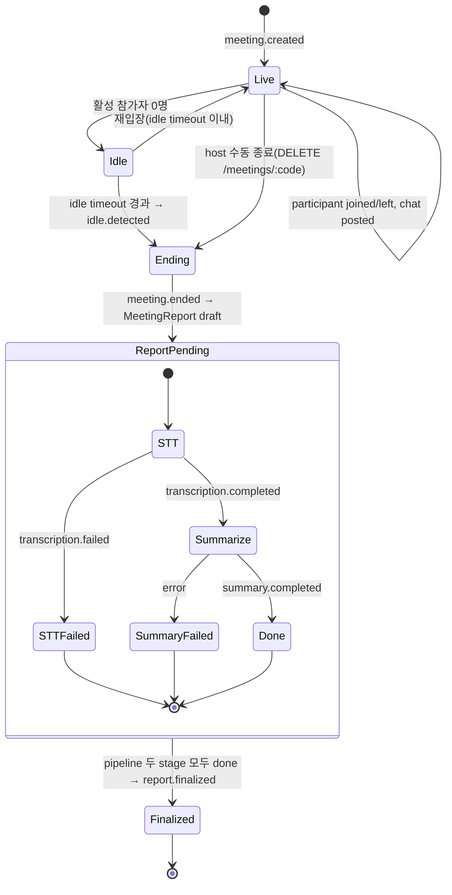
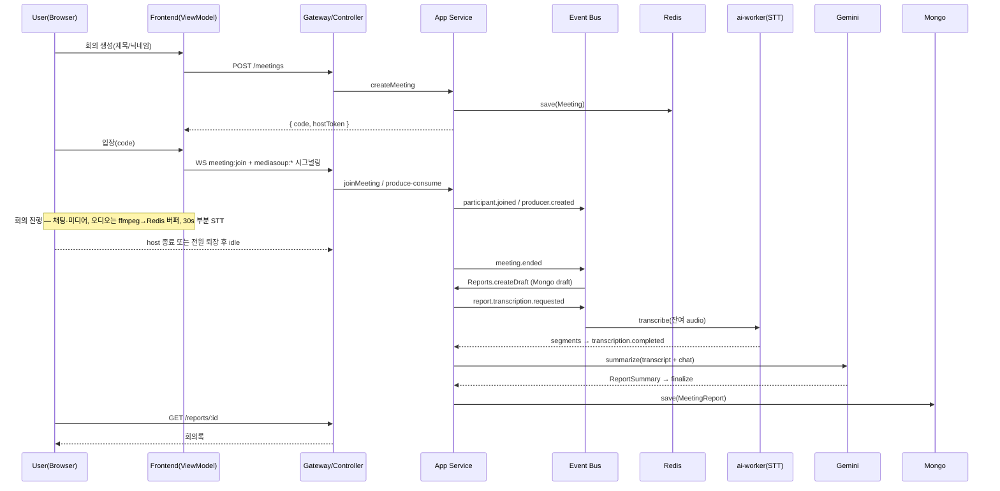

# Architecture & Design Pattern

이 문서는 **아키텍처 패턴**과 **도메인 모델(DDD)** 을, 실제 구현된 코드 기준으로 정의한다.
"왜 이렇게 설계했나"와 "코드의 어디에 무엇이 있나"를 함께 담는다. 코드를 따라가며
읽는 실무 가이드는 [`CODEBASE_GUIDE.md`](./CODEBASE_GUIDE.md), 범위·의사결정은
[`PLAN.md`](./PLAN.md)를 참고한다.

---

## 1. 아키텍처 패턴

| 영역     | 채택 패턴                            | 한 줄 요약                                                                          |
| -------- | ------------------------------------ | ----------------------------------------------------------------------------------- |
| Backend  | **NestJS Layered MVC + DDD 4-layer** | Interface(Controller/Gateway) → Application(Service) → Domain ← Infrastructure      |
| Frontend | **MVVM**                             | View(component, dumb) ↔ ViewModel(`useXxxViewModel` hook) ↔ Model(store/api/socket) |

- **Backend** — Bounded Context 별 NestJS 모듈. 각 모듈은 `interface/ application/ domain/ infrastructure/`
  4계층. 의존 방향은 항상 안쪽(Domain)을 향하고, Domain 은 프레임워크를 import 하지 않는다.
  Application 은 Domain 에 정의된 **Port(인터페이스)** 로만 Infrastructure 와 통신하며, 구현체는
  NestJS DI(주로 `useFactory`)로 주입된다.
- **Frontend** — View 는 props 만 받는 dumb 컴포넌트로 `fetch`/`useState`/`useEffect`/socket/
  zustand setter 를 직접 호출하지 않는다. 모든 상태·부수효과는 ViewModel hook 에, 데이터 접근은
  Model(zustand store + api/socket 모듈)에 둔다.

---

## 2. 도메인 모델 (DDD)

### 2.1 Ubiquitous Language

| 용어                 | 정의                                                                                                                   |
| -------------------- | ---------------------------------------------------------------------------------------------------------------------- |
| **Meeting**          | 한 번의 회의 세션. `code` 로 입장. hard limit 없음, 전원 퇴장 후 idle 지속 시 자동 종료. host 토큰 보유자만 수동 종료. |
| **Participant**      | 닉네임만으로 입장한 사용자(회원 아님). socket id 가 식별자.                                                            |
| **MeetingCode**      | 8자 소문자 영숫자 입장 식별자(VO). URL `/meetings/[code]`.                                                             |
| **ParticipantMedia** | 한 참가자의 미디어 상태(transport/producer/consumer 식별자). Mediasoup BC 의 Aggregate.                                |
| **MeetingReport**    | 회의 종료 시 만들어지는 회의록 Aggregate(제목·요약·결정·액션·토픽·transcript·chat). MongoDB 영속.                      |
| **PipelineState**    | STT → Summary 후처리 상태머신(VO).                                                                                     |
| **Source**           | 회의 생성 출처. v1 = `web`, v2 = `notion-issue`.                                                                       |
| **Idle**             | 활성 참가자 0명 상태가 `IdleTimeout` 이상 지속됨 → 자동 종료.                                                          |

### 2.2 Bounded Context Map

```
                       meeting.* domain events (event bus)
   ┌──────────────────┐   meeting.participant.joined   ┌────────────────────┐
   │  Meeting          │ ─────────────────────────────▶ │  Mediasoup          │
   │  (meeting/)       │   meeting.ended (+ idle)        │  (mediasoup/)       │
   │  회의·입장·채팅    │ ──────────────┐                │  SFU 시그널링        │
   │  ·idle·종료        │               │                │  ParticipantMedia    │
   └────────┬──────────┘               │                └─────────┬──────────┘
            │ meeting.ended            │                          │ audio capture
            ▼                          ▼                          ▼ (ffmpeg→Redis)
   ┌──────────────────┐   report.transcription.requested  ┌────────────────────┐
   │  Reports          │ ─────────────────────────────────▶│  Recording          │
   │  (reports/)       │   report.transcription.completed  │  (recording/)       │
   │  회의록·요약·조회  │ ◀─────────────────────────────────│  STT(ai-worker)      │
   └──────────────────┘                                    └────────────────────┘
        │ SummarizerPort(Gemini) · NotionPort(Noop, v2) · ReportRepository(Mongo)

   shared-kernel/ : SystemClock, DomainEventPublisher, 공유 VO(Source·ExternalReference·
                    ChatEntry), cross-BC 이벤트 payload(MeetingEndedPayload 등)
```

- **컨텍스트 간 결합은 Domain Event(`@nestjs/event-emitter`) 또는 Port 로만.** Aggregate·Service·
  Repository 를 BC 간 직접 import 하지 않는다(CLAUDE.md hard rule 7).
- 여러 BC 가 공유하는 read-only VO·이벤트 payload 는 `shared-kernel/domain/` 에 둔다(DDD Shared Kernel).
- **chat 은 별도 모듈이 아니라 Meeting BC 안**에서 처리된다(gateway `meeting:chat` → `MeetingService.postChat`
  → Redis `ChatRepository`). 회의 종료 시 누적 chat 이 `meeting.ended` payload 로 Reports 에 이관된다.

### 2.3 Aggregate / Entity / VO

| Aggregate Root     | 위치                                    | Entity / VO                                                                                                                     | 핵심 불변식                                                                                     |
| ------------------ | --------------------------------------- | ------------------------------------------------------------------------------------------------------------------------------- | ----------------------------------------------------------------------------------------------- |
| `Meeting`          | `meeting/domain/meeting.ts`             | Entity `Participant`; VO `MeetingCode`·`IdleTimeout`; 공유 VO `Source`·`ExternalReference`                                      | `endedAt` 이 채워지면 mutating 거부; idle 은 활성 0명일 때만 작동; host 토큰 일치자만 수동 종료 |
| `ParticipantMedia` | `mediasoup/domain/participant-media.ts` | producer/consumer entry; `MediaType`                                                                                            | send transport 없이 producer 불가; producerId/consumerId 중복 불가                              |
| `MeetingReport`    | `reports/domain/meeting-report.ts`      | `TranscriptSegment`·`ParticipantEntry`(entries/); VO `ReportSummary`·`ActionItem`·`KeyTopic`·`PipelineState`·`NotionPushResult` | `summaryStatus==='done'` 일 때만 `summary` 존재; pipeline 이 final 이어야 Notion push           |

### 2.4 Domain Event 카탈로그

이벤트 이름 문자열의 단일 진실원은 `packages/shared-interfaces/src/events.ts`.

| 이벤트 상수                             | 문자열                           | 발행                                | 주요 구독자                                                  |
| --------------------------------------- | -------------------------------- | ----------------------------------- | ------------------------------------------------------------ |
| `MEETING_EVENTS.CREATED`                | `meeting.created`                | `MeetingService.createMeeting`      | (v2 Notion)                                                  |
| `MEETING_EVENTS.PARTICIPANT_JOINED`     | `meeting.participant.joined`     | `joinMeeting`                       | Mediasoup(미디어 admit)                                      |
| `MEETING_EVENTS.PARTICIPANT_LEFT`       | `meeting.participant.left`       | `leaveMeeting`                      | Mediasoup(정리)                                              |
| `MEETING_EVENTS.CHAT_POSTED`            | `meeting.chat.posted`            | `postChat`                          | (누적은 Redis, 종료 시 이관)                                 |
| `MEETING_EVENTS.IDLE_DETECTED`          | `meeting.idle.detected`          | `detectIdleAndClose`                | 로깅/관측                                                    |
| `MEETING_EVENTS.ENDED`                  | `meeting.ended`                  | `closeMeeting`/`detectIdleAndClose` | **Reports(draft 생성)**, Mediasoup·MeetingGateway(broadcast) |
| `REPORT_EVENTS.TRANSCRIPTION_REQUESTED` | `report.transcription.requested` | `createDraft`                       | Recording(STT)                                               |
| `REPORT_EVENTS.TRANSCRIPTION_COMPLETED` | `report.transcription.completed` | Recording                           | Reports(요약)                                                |
| `REPORT_EVENTS.TRANSCRIPTION_FAILED`    | `report.transcription.failed`    | Recording                           | Reports(실패 기록)                                           |
| `REPORT_EVENTS.SUMMARY_COMPLETED`       | `report.summary.completed`       | Reports                             | (v2 Notion push)                                             |
| `REPORT_EVENTS.FINALIZED`               | `report.finalized`               | Reports                             | UI 알림                                                      |
| `MEDIASOUP_EVENTS.PRODUCER_CREATED`     | `mediasoup.producer.created`     | `produce`                           | MediasoupGateway → `mediasoup:newProducer` WS broadcast      |

`DomainEventPublisher.publish` 는 `emitter.emitAsync` 로 **모든 listener 를 await** 한다(admit race 회피).

---

## 3. 백엔드 레이어 매핑

```
<context>/
├── interface/        controllers · gateways · dto(class-validator)   ← HTTP/WS 경계
│                     payload 검증 → 도메인 호출 → wire 직렬화. 그 외 로직 금지.
├── application/      *.service.ts · *.listener.ts                     ← use-case 조립
│                     Port 로만 Infrastructure 호출. 도메인 이벤트 발행은 여기서.
├── domain/           {aggregate}.ts · value-objects/ · ports/          ← 순수 TS
│                     불변식·정책·계산. 프레임워크 import 0. Port = TS 인터페이스.
└── infrastructure/   repository 구현 · mediasoup 어댑터 · 외부 adapter   ← 기술 상세
                      Redis/Mongo/mediasoup/HTTP. Port 를 구현한다.
```

**의존성 방향**: `Interface → Application → Domain ← Infrastructure`. Domain 은 어떤 계층에도
의존하지 않는다. Application 은 Port 인터페이스에만 의존하고, 구현체는 모듈의 `useFactory` 로 주입된다.

### 3.1 모듈 ↔ Bounded Context

| 모듈                | 역할                               | 주요 구성요소                                                                                                                                                                                                                                    |
| ------------------- | ---------------------------------- | ------------------------------------------------------------------------------------------------------------------------------------------------------------------------------------------------------------------------------------------------ |
| `meeting/`          | 회의 생성·입장·퇴장·채팅·idle·종료 | `MeetingController`(POST/DELETE `/meetings`), `MeetingGateway`(`meeting:join/leave/chat` + `meeting:ended` broadcast), `MeetingService`, `Meeting`/`Participant`, Redis `meeting`/`chat` repo, `RandomMeetingCodeGenerator`·`HostTokenGenerator` |
| `mediasoup/`        | WebRTC SFU 시그널링                | `MediasoupGateway`(`mediasoup:*` RPC), `MediasoupSignalingService`, `ParticipantMedia`, worker pool · router · transport 어댑터, `FfmpegAudioCaptureAdapter`, meeting 이벤트 구독 lifecycle listener                                             |
| `recording/`        | 음성 STT(오디오 즉시 폐기)         | `PartialTranscriptionScheduler`(회의 중 30s 주기), `RecordingService`(종료 시 chunk transcribe), `TranscriberPort`(`HttpTranscriber`→ai-worker), audio-buffer · partial-transcript store(Redis)                                                  |
| `reports/`          | 회의록 finalize·조회               | `ReportsController`(GET `/reports`, `/reports/:id`), `ReportFinalizationService`, `MeetingReport`, `SummarizerPort`(`GeminiSummarizer`/`NoopSummarizer`), `NotionPort`(`NoopNotion`), `ReportRepository`(`MongoReportRepository`)                |
| `shared-kernel/`    | 공유 커널(@Global)                 | `SystemClock`, `NestEventBusDomainEventPublisher`, 공유 VO(`Source`·`ExternalReference`·`ChatEntry`), cross-BC 이벤트 payload(`MeetingEndedPayload` 등)                                                                                          |
| `redis/` · `mongo/` | 인프라 모듈(@Global)               | ioredis 클라이언트, mongoose connection                                                                                                                                                                                                          |
| `config/`           | 부트스트랩 env 해석                | `server`·`mongo`·`redis`·`gemini`·`ai-worker`·`mediasoup` config 순수 함수                                                                                                                                                                       |

전역 설정: `ConfigModule.forRoot({ isGlobal: true })`, `EventEmitterModule.forRoot({ wildcard: true })`,
글로벌 `ValidationPipe({ whitelist, forbidNonWhitelisted, transform })`(`main.ts`), WS 는 게이트웨이의
`@UsePipes` 로 동일 ValidationPipe + `WsException` exceptionFactory 적용.

### 3.2 Port / Adapter

| Port                                                                                   | 위치                     | v1 구현                                                              |
| -------------------------------------------------------------------------------------- | ------------------------ | -------------------------------------------------------------------- |
| `MeetingRepository` / `ChatRepository`                                                 | `meeting/domain/ports`   | `RedisMeetingRepository` / `RedisChatRepository`(테스트는 in-memory) |
| `ParticipantMediaRepository`·`MediaRouterPort`·`MediaTransportPort`·`AudioCapturePort` | `mediasoup/domain/ports` | Redis · mediasoup worker/router/transport · ffmpeg 어댑터            |
| `TranscriberPort`                                                                      | `recording/domain/ports` | `HttpTranscriber`(ai-worker `POST /transcribe`)                      |
| `SummarizerPort`                                                                       | `reports/domain/ports`   | `GeminiSummarizer`(키 없으면 `NoopSummarizer`)                       |
| `NotionPort`                                                                           | `reports/domain/ports`   | `NoopNotion`(v2에서 실구현 교체)                                     |
| `ReportRepository`                                                                     | `reports/domain/ports`   | `MongoReportRepository`                                              |

---

## 4. 프론트엔드 MVVM 매핑

```
app/                         라우트(정적 export). 'use client' + useParams() 로 동적 경로.
├── page.tsx                 메인(회의 만들기/입장)
├── meetings/[code]/         MeetingPageClient — VM 합성 + 닉네임 게이트 분기
└── reports/, reports/[id]/  회의록 목록·상세

feature/<name>/
├── components/   View — props 만. (MeetingScreen, ChatPanel, RemoteVideoTile, NicknameGate, …)
├── hooks/        ViewModel — useXxxViewModel (useMeetingViewModel, useMediasoupViewModel, …)
shared/
├── api/          Model — fetch (meeting.api, reports.api, config)
├── socket/       Model — socket.io 클라이언트 싱글톤 + mediasoup device factory
└── stores/       Model — zustand (session.store, host-token.storage)
```

- **View 규칙(강제)**: View 는 `useState`/`useEffect`/`fetch`/socket/zustand setter 를 직접 호출하지
  않는다. 필요한 데이터·콜백은 ViewModel hook 반환에서 받는다. ViewModel 반환은 인터페이스로
  명시(`UseMeetingViewModel`)해 View 가 그대로 prop 타입으로 받게 한다(테스트 용이).
- **페이지 합성**: `MeetingPageClient` 가 `useMeetingViewModel`(socket·참가자) + `useMediasoupViewModel`
  (미디어) + `useChatViewModel`(채팅) + `useMeetingLayoutViewModel`(레이아웃) 을 합성한다.
- **정적 export 제약**: `output: 'export'`. server component 데이터 fetch·`route.ts`·middleware 금지.
  동적 라우트는 client + `useParams()`, 데이터는 `fetch(NEXT_PUBLIC_API_URL/...)`. CloudFront `/404 → /index.html` fallback.

---

## 5. 회의록 파이프라인 상태도



STT/Summary 실패도 도큐먼트는 영속되며 `pipeline.failures[]` 에 기록된다(재시도는 v2).
회의 중에는 `PartialTranscriptionScheduler` 가 30초마다 부분 STT 를 누적해, 종료 시 잔여만 처리한다.

---

## 6. 핵심 시퀀스 (회의 한 건)



---

## 7. v2 확장 지점 (변경 없이 추가)

1. 새 BC `notion/` 추가 → `report.finalized`/`report.summary.completed` 구독.
2. `NotionPort` 실구현 등록(Noop 교체) → `MeetingReport.attachNotionPushResult`.
3. 회의 생성 시 `source: 'notion-issue'` + `externalReference.issueId` 분기(자리 이미 있음).
4. CloudFront CSP `frame-ancestors` 에 노션 도메인 추가.

---

## 8. 결정 로그 (ADR-lite)

| #   | 결정                                           | 근거                                                |
| --- | ---------------------------------------------- | --------------------------------------------------- |
| 1   | Backend Layered MVC + DDD 4-layer              | 현 구조 연속성, 테스트 친화, v2 확장 지점 명확화    |
| 2   | Frontend MVVM (View = dumb)                    | "데이터만 보여주는 View" 요구, hooks 관용과 일치    |
| 3   | Domain Event + Port 로 BC 분리                 | 직접 의존 차단, v2 Notion 어댑터 추가 비용 최소화   |
| 4   | 실시간 상태 Redis, 영속 Mongo                  | 책임 분리(회의 진행 상태 vs 회의록 영속)            |
| 5   | 오디오 즉시 폐기(S3 미사용)                    | 개인정보·비용. ffmpeg→Redis 버퍼→STT 후 삭제        |
| 6   | LLM/STT 는 Port 경유                           | Gemini/faster-whisper 로 시작하되 교체 가능         |
| 7   | DomainEventPublisher.publish = emitAsync await | admit race 회피(미디어가 join 이벤트를 놓치지 않게) |
