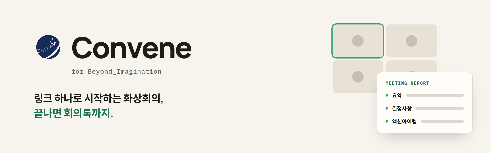
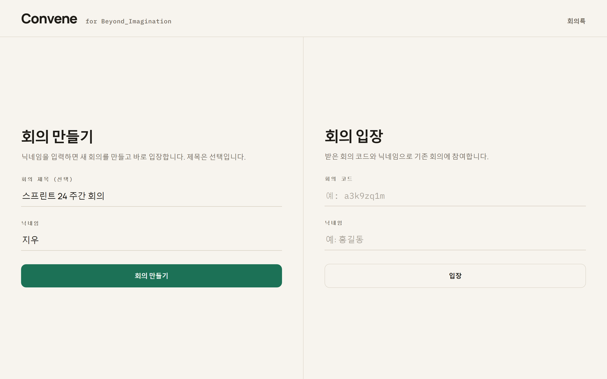
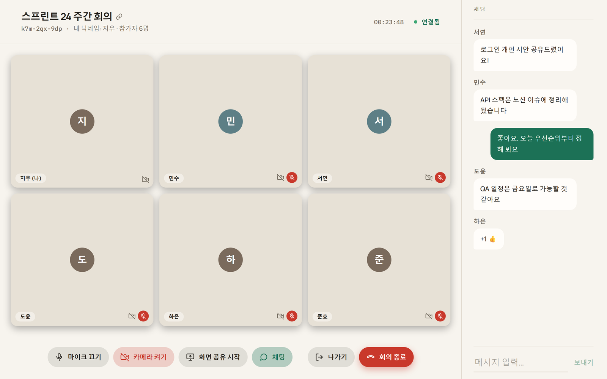
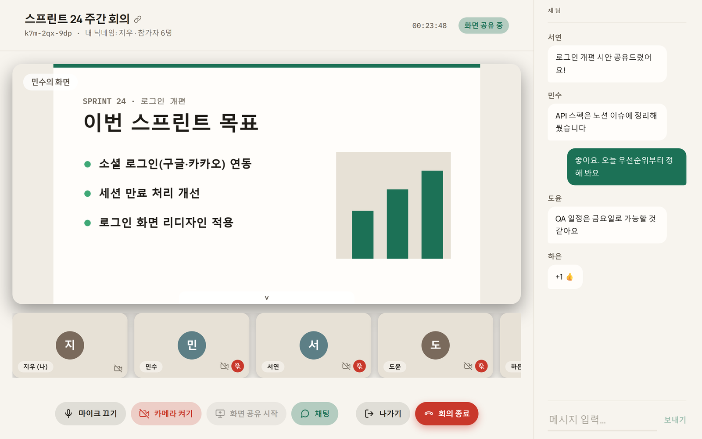
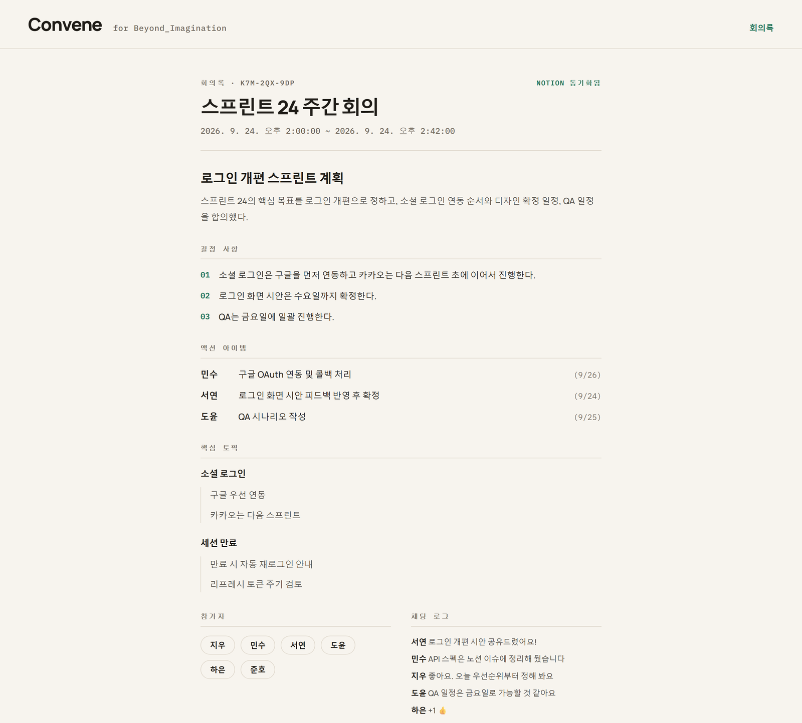
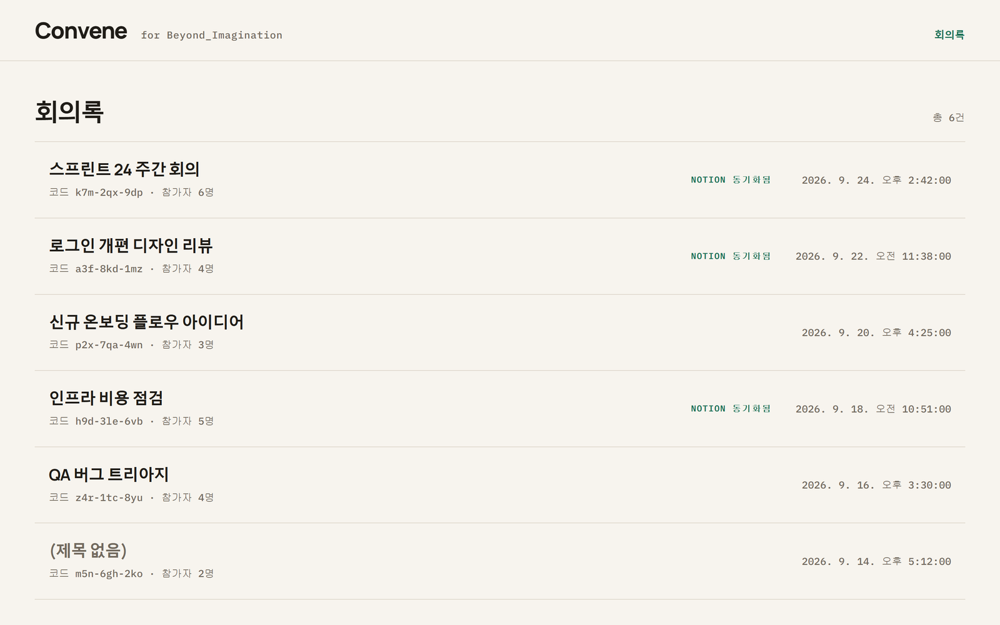

<picture>
  <source media="(prefers-color-scheme: dark)" srcset=".github/assets/banner-dark.png">
  
</picture>

## 주요 기능

### 🎥 바로 시작하는 화상회의

닉네임만 입력하면 회의가 열린다. 회의 제목을 누르면 초대 링크가 복사되고, 받은 사람도 닉네임만 넣으면 바로 들어온다.

<picture>
  <source media="(prefers-color-scheme: dark)" srcset=".github/assets/shot-home-dark.png">
  
</picture>

### 💬 화상·음성·채팅을 한 화면에서

여러 명이 함께하는 화상·음성 회의에 실시간 채팅이 붙어 있다. 카메라·마이크는 꺼진 채로 입장하고, 필요할 때 켠다.

<picture>
  <source media="(prefers-color-scheme: dark)" srcset=".github/assets/shot-meeting-dark.png">
  
</picture>

### 🖥️ 화면 공유

발표자의 화면을 크게 띄우고, 참가자는 아래 줄에 모아 보여 준다.

<picture>
  <source media="(prefers-color-scheme: dark)" srcset=".github/assets/shot-share-dark.png">
  
</picture>

### 📝 끝나면 자동으로 회의록

회의가 끝나면 음성을 받아 적고 AI가 **요약 · 결정사항 · 액션아이템 · 핵심 토픽**으로 정리한다. 참가자와 채팅 기록도 함께 남는다.
녹음 파일은 남기지 않는다 — 음성은 받아 적는 데만 쓰고 바로 지운다.

<picture>
  <source media="(prefers-color-scheme: dark)" srcset=".github/assets/shot-report-dark.png">
  
</picture>

### 🔗 노션 연동

노션 이슈로 회의를 만들고, 끝나면 회의록을 그 이슈 페이지에 넣는다. 회의록 목록에서 노션에 동기화된 회의록을 바로 알아볼 수 있다.

<picture>
  <source media="(prefers-color-scheme: dark)" srcset=".github/assets/shot-reports-dark.png">
  
</picture>

## 사용 방법

1. 닉네임과 제목으로 회의를 만든다.
2. 회의 제목을 눌러 초대 링크를 공유한다.
3. 회의를 마치면 **회의록** 메뉴에서 결과를 확인한다.

## 기술 스택

Next.js · NestJS · Mediasoup · Socket.IO · Redis · MongoDB · faster-whisper · Gemini

## 개발

실행·테스트·기여 방법은 [`DEVELOPMENT.md`](./DEVELOPMENT.md)를 본다.
